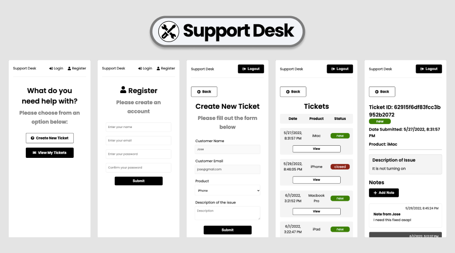
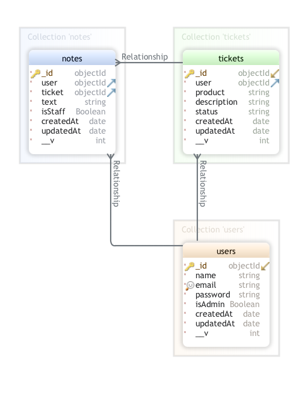

# Support Desk MERN App

## Welcome! 👋

This project was coded during the course "React Front to Back 2022" by Brad Traversy. The goal was to build a Support Desk WebApp using the MERN stack (MongoDB, Express, React and Node.js). This was my first step towards becoming a full stack developer in the future.

## Table of contents

- [Overview](#overview)
  - [The challenge](#the-challenge)
- [My process](#my-process)
  - [Built with](#built-with)
  - [Database Diagram](#database-diagram)
- [Author](#author)

## Overview

### The challenge

- Create a full stack Support Desk React App that allows users to register/login, create tickets and post notes.

- Features:

1. Sign up and login functionality (email): Nodejs, Express and MongoDB Atlas
2. MongoDB Atlas Database to store users, tickets and notes
3. JSONWebToken to control private routes
4. User password hashing with Bcryptjs
5. State management with Redux Toolkit
6. Create tickets describing user issues (Product and Description)
7. Display all tickets from a user
8. Close tickets once the issue is resolved
9. Post notes to communicate with staff
10. React Toastify notifications

## My process

### Built with

- React Hooks
- React Router 6
- Redux Toolkit
- MongoDB Atlas
- Express
- Node.js
- [Bcryptjs](https://www.npmjs.com/package/bcryptjs)
- [Axios](https://www.npmjs.com/package/axios)
- [React Modal](https://www.npmjs.com/package/react-modal)
- [React Toastify](https://www.npmjs.com/package/react-toastify)

### Database Diagram

## Author

Coded by José Pessoa 🧪 💻
